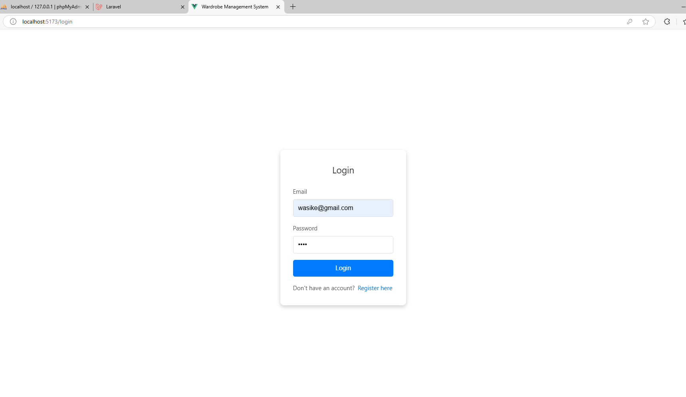
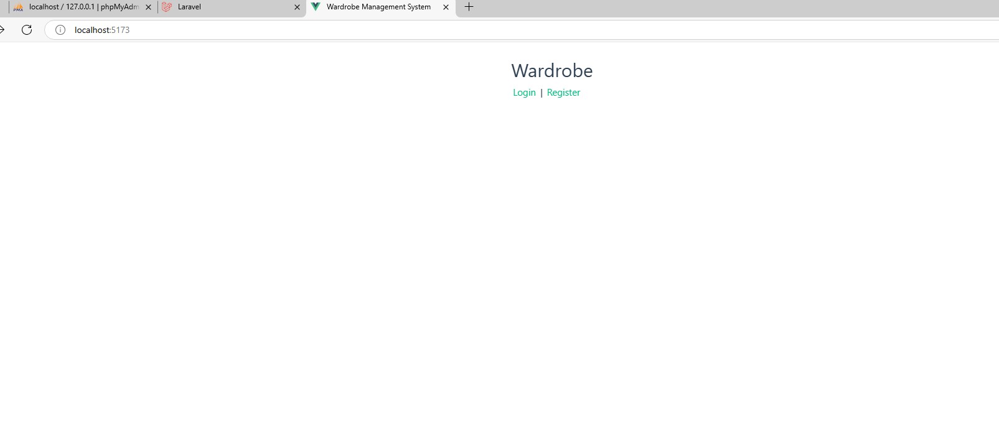

# Wardrobe Management System

The Wardrobe Management System is a web application built with Vue 3 (frontend) and Laravel 11 (backend). It allows users to manage their clothing items, categorize them, and filter/search through their wardrobe. The system also includes user authentication (login/registration) and a responsive, user-friendly interface.


## Features

### User Authentication:
- Login and registration functionality.
- Token-based authentication using Laravel Sanctum.

### Clothing Item Management:
- Add, edit, and delete clothing items.
- Categorize items (e.g., tops, bottoms, shoes).

### Filter and Search:
- Filter clothing items by category.
- Search for specific items by name or description.

## Setup Instructions

### Backend

1. Navigate to the backend directory:
   ```sh
   cd backend
   ```

2. Install the dependencies:
   ```sh
   composer install
   ```

3. Set up your database in the `.env` file.

4. Run the database migrations:
   ```sh
   php artisan migrate
   ```

5. Start the Laravel development server:
   ```sh
   php artisan serve
   ```

### Frontend

1. Navigate to the frontend directory:
   ```sh
   cd wardrobe-frontend
   ```

2. Install the dependencies:
   ```sh
   npm install
   ```

3. Start the Vue development server:
   ```sh
   npm run dev
   ```





